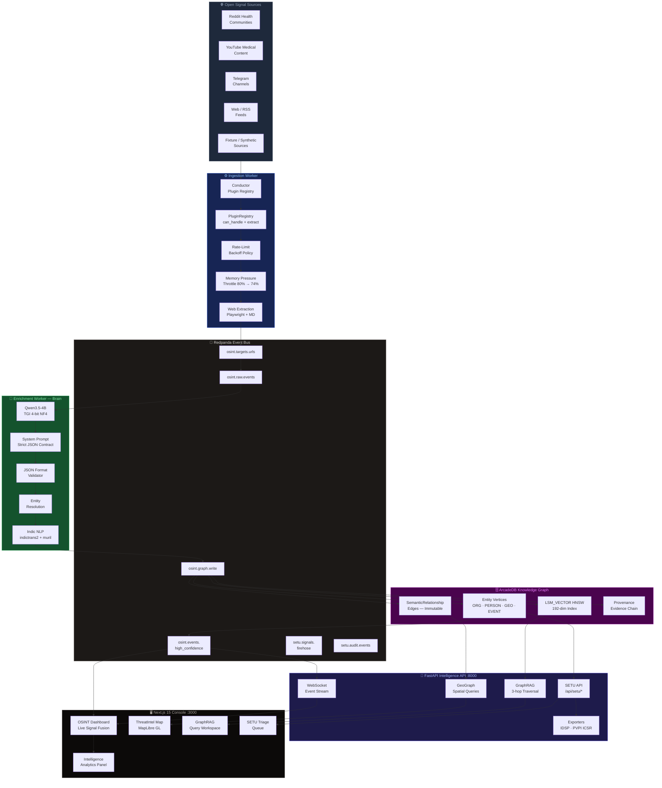

<div align="center">

<!-- Animated title -->


<br/>


&nbsp;

&nbsp;


<br/><br/>

[](https://python.org)
[](https://fastapi.tiangolo.com)
[](https://nextjs.org)
[](https://www.typescriptlang.org)
[](https://maplibre.org)
[](https://recharts.org)
[](https://redpanda.com)
[](https://arcadedb.com)
[](https://huggingface.co/Qwen)
[](LICENSE)

<br/>

> **सेतु = Bridge · आरोग्य = Health/Wellbeing · दृष्टि = Vision/Intelligence**
>
> *A sovereign, air-gappable public-health intelligence engine that watches every open signal on the planet, reasons over them in a living knowledge graph, and surfaces epidemic clusters, adverse drug events, and health misinformation before they become crises — entirely on-premises, with no data leaving your infrastructure.*

---

</div>

## ⚡ The Core Insight — Why This Platform Exists

> *"The signs were always there. Nobody connected them in time."*

Every public health crisis of the last decade — from the early COVID-19 signals buried in Chinese forums to the dengue cluster warnings lost in district surveillance noise — left a trail of publicly-accessible signals that nobody synthesised fast enough.

**SETU AAROGYA DRISHTI** is built to end that permanently.

The platform ingests multi-source open signals (Reddit health communities, YouTube medical content, RSS disease feeds, Telegram channels, and arbitrary web pages), extracts structured medical intelligence using a **locally-running Qwen LLM**, resolves entities across languages including **22 scheduled Indian languages**, and continuously writes the results into a **living knowledge graph** — from which it generates regulatory-ready exports, triage queues, and real-time alerts.

No cloud dependency. No data egress. No vendor lock-in. **Deployable on a single workstation with an 8 GB GPU.**

---

## 📺 System Overview

```
┌────────────────────────────────────────────────────────────────────────────────┐
│                    SETU AAROGYA DRISHTI — ARGUS INTELLIGENCE CORE              │
├─────────────────────────┬──────────────────────────────────────────────────────┤
│   OPEN-SOURCE SIGNALS   │  Reddit · YouTube · RSS · Telegram · Web · Fixture   │
│   (6+ connector types)  │  Social health forums · News feeds · Gov portals     │
├─────────────────────────┴──────────────────────────────────────────────────────┤
│                     INGESTION WORKER  (Conductor)                               │
│  Dynamic plugin registry · Rate-limit backoff · Memory-pressure throttling     │
│  Consent-banner auto-dismiss · Shadow-DOM flattening · Playwright extraction   │
├────────────────────────────────────────────────────────────────────────────────┤
│         Redpanda  ·  Kafka-compatible event bus  ·  Schema Registry             │
│  osint.targets.urls  ·  osint.raw.events  ·  setu.signals.firehose             │
│  osint.graph.write   ·  osint.events.high_confidence  ·  setu.audit.events     │
├────────────────────────────────────────────────────────────────────────────────┤
│                     ENRICHMENT WORKER  (Brain)                                  │
│  Qwen3.5-4B · 4-bit NF4 quantization · EXTRACTION_SYSTEM_PROMPT               │
│  Entity types: ORG · PERSON · GEO · EVENT                                      │
│  Medical types: DRUG · SYMPTOM · CONDITION · PROCEDURE · DEVICE · ADV_EVENT   │
│  Indic NLP: ai4bharat/indictrans2 · google/muril-base-cased lang-ID            │
│  Fallback: heuristic-regex extraction when LLM unavailable                     │
├────────────────────────────────────────────────────────────────────────────────┤
│                     ENTITY RESOLUTION ENGINE                                    │
│  Hybrid lexical + semantic deduplication · BLAKE2b n-gram hash embeddings      │
│  Jaro-Winkler edit distance · Legal token normalisation (Corp/Ltd/Inc)          │
│  Cosine similarity merge threshold 0.08 · 4096-candidate batch resolution     │
│  fastembed BAAI/bge-small-en-v1.5 swappable high-accuracy mode                │
├────────────────────────────────────────────────────────────────────────────────┤
│                     GRAPH WRITER WORKER                                         │
│  ArcadeDB upsert via SQL-script · Entity vertex type: Entity                   │
│  Relationship edge type: SemanticRelationship (immutable historical records)   │
│  LSM_VECTOR HNSW index · 192-dim evidence embeddings · COSINE similarity       │
│  High-confidence event notifications → osint.events.high_confidence           │
├────────────────────────────────────────────────────────────────────────────────┤
│                   ArcadeDB  Multi-Model Knowledge Graph                         │
│  Document store · Graph database · Vector index · HTTP API on :2480            │
│  Temporal edges (valid_from / valid_until) · Full provenance chain             │
│  GraphRAG 3-hop traversal · GeoGraph (lat/lon entity spatial queries)          │
├────────────────────────────────────────────────────────────────────────────────┤
│                   BACKEND INTELLIGENCE API  (FastAPI :8000)                     │
│  /api/intelligence/* — GraphRAG · Geo-graph · Entity lookup                   │
│  /api/setu/*         — Projects · Sources · Keywords · Signals · Triage        │
│  /api/setu/*/export  — IDSP P-form draft · PVPI ICSR (ICH-E2B R3)             │
│  WebSocket /ws/events — Real-time high-confidence event streaming              │
│  /healthz · /config  — Operational diagnostics                                 │
├────────────────────────────────────────────────────────────────────────────────┤
│              NEXT.JS 15 OPERATOR CONSOLE  (Turbopack  :3000)                   │
│  Overview · GraphRAG · Streams · Alerts · Entities · Database · Reports        │
│  SETU Triage · SETU Signals · SETU Projects · Settings                        │
│  MapLibre GL threat map · Recharts analytics suite · Live WebSocket feeds      │
└────────────────────────────────────────────────────────────────────────────────┘
```

---

## 🏗️ Architecture



---

## 🧬 Data Pipeline Deep Dive

### Stage 1 — Ingestion (Conductor)

The **Conductor** is the first node in the pipeline. It consumes `TargetURL` messages from the `osint.targets.urls` topic, routes each URL through the **PluginRegistry**, and publishes immutable `RawEvent` records to `osint.raw.events`.

| Capability | Implementation Detail |
|---|---|
| **Dynamic plugin loading** | Entry-point group `localized_osint.collectors`; plugins register via `plugin.can_handle(target)` |
| **Rate-limit backoff** | Exponential: `0.25s × 2^(attempt−1)` + 20% jitter, cap `30s`, max 5 attempts |
| **Memory throttle** | `psutil` reader; pause at 80% RAM, resume at 74% — prevents OOM on long crawls |
| **Concurrent dispatch** | `asyncio.Semaphore(32)` — 32 parallel fetches maximum |
| **Proxy pool** | Round-robin `ProxyPool` with async lock; disables gracefully if no proxies configured |
| **Web extraction** | Playwright headless Chromium; consent-banner auto-dismiss (120-button scan); shadow-DOM flattening; `markdownify` conversion; boilerplate stripper |
| **Raw event schema** | Strict Pydantic — immutable, timezone-aware timestamps, unknown fields rejected |

### Stage 2 — Enrichment (Brain)

The **Brain** worker consumes `RawEvent` records, sends each raw Markdown payload to the **Qwen3.5-4B** local LLM, parses the strict JSON response, and publishes `GraphWriteBatch` messages.

```
Raw Markdown ──► EXTRACTION_SYSTEM_PROMPT ──► Qwen3.5-4B (TGI, 4-bit NF4)
     │                                               │
     └─ fetch_timestamp attached                     ▼
                                          {"entities": [...], "relationships": [...]}
                                                     │
                              ┌──────────────────────┼──────────────────────┐
                              ▼                      ▼                      ▼
                        JSON Block             JSON Format              Pydantic
                        Extractor              Validator               Validation
                              └──────────────────────┴──────────────────────┘
                                                     │
                                          Entity Resolution
                                      (lexical + semantic dedup)
                                                     │
                                          GraphWriteBatch ──► osint.graph.write
```

**LLM Extraction Contract** (enforced by system prompt):
- Entity types: `ORG | PERSON | GEO | EVENT` — nothing else accepted
- Each entity: `id` (RFC 4122 UUID), `entity_type`, `confidence` (0.0–1.0), `source_count`, `last_updated` (ISO-8601 UTC)
- Each relationship: `confidence`, `valid_from`, `evidence_text` (≤ 8,192 chars)
- Zero hallucination policy: blocked domain terms enforced at schema validation
- `max_extraction_retries: 2` with temperature `0.1` for deterministic output
- **Fallback heuristic-regex engine** activates when LLM is unavailable — visible in the frontend as `engine: heuristic-regex`

### Stage 3 — Entity Resolution

Before any entity enters the graph, the **EntityResolver** deduplicates it against every existing entity of the same type.

| Algorithm | Detail |
|---|---|
| **Candidate batch** | Up to 4,096 existing entities loaded per batch |
| **Lexical distance** | Jaro-Winkler with legal-token normalisation (`Corp → Corporation`, `Ltd → Limited`) |
| **Semantic distance** | BLAKE2b n-gram hash embeddings (192 dims, 3–5-gram range) → cosine similarity |
| **Merge threshold** | Semantic cosine distance < `0.08` → merge; lexical threshold `0.42` for candidates |
| **Optional high-accuracy** | `fastembed` `BAAI/bge-small-en-v1.5` swappable as embedding backend |

### Stage 4 — Graph Write

The **GraphWriter** worker persists deduplicated entities and relationships into **ArcadeDB** via SQL-script commands.

- **Entity vertices** are upserted (create-or-update) with full provenance
- **Relationship edges** are **immutable** — a new `valid_from` creates a new edge, never overwriting historical connections
- **Evidence embeddings**: each relationship's `evidence_text` is embedded (192-dim BLAKE2b hash) and stored as `evidence_embedding` on the edge
- **LSM_VECTOR index** with HNSW (`max_connections=16`, `beam_width=100`, `COSINE` similarity) bootstrapped at first write
- High-confidence events (`confidence ≥ threshold`) forwarded to `osint.events.high_confidence` → WebSocket broadcast

### Stage 5 — Intelligence Query (GraphRAG)

```
User Query ──► LocalQueryEmbeddingModel (192-dim, BLAKE2b hash)
                        │
                        ▼
          ArcadeDB LSM_VECTOR nearest-neighbour
          Top-K=5 seed relationships by cosine similarity
                        │
                        ▼
          Graph traversal — 3 hops outward from seed nodes
                        │
                        ▼
          Subgraph response: entities + relationships + evidence
                        │
                        ▼
          GraphRAG Workspace — interactive graph visualisation
```

---

## 🏥 SETU — Public Health Intelligence Module

SETU is a purpose-built health-surveillance surface layered on top of the ARGUS intelligence core. It is the **primary innovation** of this prototype.

### Why a Separate Layer?

The OSINT core enforces `FORBIDDEN_DOMAIN_TERMS` — words like `"risk"`, `"adverse"`, `"campaign"`, `"threat"` are blocked from the generic knowledge graph to prevent noise. Healthcare content is *defined* by these terms. SETU introduces `HealthBaseSchema` — identical strictness guarantees (frozen, extra=forbid, strict typing) but without the domain-term rejection.

### Signal Taxonomy

| Signal Kind | Description | Regulatory Output |
|---|---|---|
| `adr` | Adverse Drug Reaction — unrecognised side effects surfaced from social posts | **PVPI ICSR** (ICH-E2B R3 / VigiFlow format) |
| `cluster` | Geographic cluster of symptom reports — potential outbreak indicator | **IDSP P-form** (presumptive case line-list) |
| `trend` | Statistical upward trend in a symptom/condition keyword set | Trend report (dashboard) |
| `misinformation` | Harmful health misinformation propagation pattern detected | Analyst triage queue |

### Medical Entity Schema

```
MedicalEntityKind
├── DRUG           — Pharmaceutical product or active substance
├── SYMPTOM        — Reported symptom or clinical sign
├── CONDITION      — Diagnosed or suspected medical condition
├── PROCEDURE      — Medical procedure or intervention
├── DEVICE         — Medical device or equipment
├── FACILITY       — Hospital, clinic, pharmacy, dispensary
├── ADVERSE_EVENT  — Serious adverse event or unexpected outcome
└── DEMOGRAPHIC    — Age group, gender, or population segment
```

### Coding Systems Supported

| System | Scope |
|---|---|
| `SNOMED-CT` | Clinical concepts (symptoms, procedures, findings) |
| `ICD-11` | International disease classification (WHO 2019+) |
| `ICD-10` | Legacy disease classification |
| `WHO-DRUG` | WHO international drug dictionary |
| `RxNorm` | US drug normalisation (FDA) |
| `MedDRA` | Medical Dictionary for Regulatory Activities |
| `LOCAL` | Custom institutional code mappings |

### Source Connectors

| Connector | Latency Tier | Credential Required |
|---|---|---|
| `reddit` | realtime | `REDDIT_CLIENT_ID` + `REDDIT_CLIENT_SECRET` |
| `youtube` | daily | `YOUTUBE_COOKIES_PATH` (yt-dlp cookies) |
| `telegram` | realtime | `TELEGRAM_API_ID` + `TELEGRAM_API_HASH` + session |
| `rss` | daily / weekly | None |
| `web` | daily | None (Playwright headless) |
| `x_fixture` | — | Synthetic test fixture |

### SETU API Surface

```
POST   /api/setu/projects                     Create surveillance project
GET    /api/setu/projects                     List all projects
PATCH  /api/setu/projects/{id}                Update / link keyword set
DELETE /api/setu/projects/{id}                Archive project

POST   /api/setu/projects/{id}/sources        Add data source
GET    /api/setu/projects/{id}/sources        List sources + health snapshots

POST   /api/setu/projects/{id}/keyword-sets   Create monitored keyword set
GET    /api/setu/projects/{id}/keyword-sets   List keyword sets

GET    /api/setu/projects/{id}/signals        Query triage queue (kind/status filters)
POST   /api/setu/signals/{id}/triage          Submit triage decision
GET    /api/setu/signals/{id}/triage          Full triage decision history

GET    /api/setu/signals/{id}/export/idsp-p       IDSP P-form draft (JSON)
GET    /api/setu/signals/{id}/export/pvpi-icsr    PVPI ICSR ICH-E2B(R3) draft (JSON)

GET    /api/setu/audit                        Audit log (project/signal scoped)
```

### Regulatory Exports

**IDSP P-form** (Integrated Disease Surveillance Programme — Presumptive Case Line-List):
- Generated for `cluster` signals
- Contains: district, block, health facility, case count, symptom onset date, suspected diagnosis
- Format: JSON draft for analyst review before submission to IDSP portal

**PVPI ICSR** (Pharmacovigilance Programme of India — Individual Case Safety Report):
- Generated for `adr` signals
- Shaped after **ICH-E2B(R3)** — compatible with VigiFlow / WHO Uppsala Monitoring Centre format
- Contains: patient demographics, suspect drug, reaction, seriousness criteria, reporter type
- Both exporters are **pure functions** — no IO, no LLM calls, fully deterministic and testable

### Privacy & Compliance

| Feature | Implementation |
|---|---|
| PII redaction | `pii_redaction_enabled: true` — Aadhaar, PAN, mobile, email, name, address stripped before persistence |
| Audit chain | Every signal state-change appended to immutable `AuditEntry` log with actor + timestamp |
| Indic language ID | `google/muril-base-cased` — identifies 17+ Indian languages before translation |
| Indic translation | `ai4bharat/indictrans2-indic-en-dist-200M` — 200M parameter distilled model, runs locally |
| Data sovereignty | All processing on-premises; no API calls to external AI services |

---

## 🖥️ Frontend — Operator Console

The Next.js 15 (Turbopack) console runs on `:3000` with real-time WebSocket feeds and a complete intelligence workstation.

### Dashboard Panels

<details>
<summary><strong>📡 Live Feed Ingestion</strong> — Real-time signal intake visualisation</summary>

- `AreaChart` gradient signal history (last 60 pulses) per data source
- `PieChart` donut — entity kind distribution in current intake batch
- `RadialBarChart` semicircle — entity confidence distribution
- Entity histogram `BarChart` — confidence bucketed 0%–100%
- **AI Core badge**: sky-blue when heuristic regex returns entities; amber on total extraction failure; shows engine name (`heuristic-regex` / LLM model name)
- Listens to `osint:feed-pulse`, `osint:entities-extracted`, `osint:source-metrics` custom DOM events

</details>

<details>
<summary><strong>📊 Signal Metrics Panel</strong> — Deep analytics across 6 threat domains</summary>

- **VelocitySparkline** — rolling 30-point signal velocity line chart
- **ThreatLevelGauge** — semi-circular `RadialBarChart` with animated fill
- **ActivityHeatmap** — 24×7 heatmap grid of signal volume by hour/day
- **Anomaly Detection** — Z-score spike detection with `ReferenceLine` markers
- **RadarChart** — 6-axis threat domain radar: CYBER · SURV · GEO · INTEL · SITUATION · NETWORK
- **ScatterChart** — Entity analysis: x=confidence, y=source_count, z=recency bubble

</details>

<details>
<summary><strong>🗺️ ThreatIntel Map</strong> — Live geo-intelligence threat map</summary>

- **MapLibre GL 5.24** with CartoDB DarkMatter tiles
- **Heatmap layer** — entity density across geographic coordinates
- **PULSE layer** — animated sin-wave radius pulses at high-confidence entity locations (50ms interval)
- **GLOW layer** — circle glow at active event locations
- **POINT layer** — discrete entity pin with confidence-proportional opacity
- **LABEL layer** — entity canonical name labels at zoom ≥ 9
- Confidence mini-legend · `raster-brightness-max: 0.95` dark-tile fix
- SSR-safe: `dynamic(..., { ssr: false })` for edge-runtime pages

</details>

<details>
<summary><strong>🧩 Intelligence Analytics</strong> — Five-panel deep analytics suite</summary>

- **Entity Kind Treemap** — `Treemap` with `Cell` colour coding per entity kind
- **Confidence Spectrum** — `BarChart` 10-bin histogram with red → amber → cyan → green tier colouring
- **Extraction Timeline** — stacked `AreaChart` with `linearGradient` fills, 20-point rolling window
- **Source × Entity Kind Correlation Matrix** — custom CSS heatmap; cell intensity = `rgba(34,211,238, 0.08 + intensity × 0.75)`
- **Pipeline Funnel** — `FunnelChart` with 4 stages: Crawled → With Entities → Extracted → High-Confidence

</details>

<details>
<summary><strong>🔍 GraphRAG Query Workspace</strong> — Interactive knowledge graph explorer</summary>

- Natural-language query → vector similarity seed → 3-hop graph traversal
- Returns: seed relationships, entity nodes, traversal relationships — all with confidence scores
- Integrated `ThreatIntelMap` showing geographic footprint of query results
- Entity type facets + confidence range filter

</details>

<details>
<summary><strong>🏥 SETU Triage Queue</strong> — Health signal triage workstation</summary>

- Paginated signal queue with kind/status filters
- Inline triage decision submission (confirm / reject / request more data)
- Full triage decision history per signal
- One-click regulatory export: IDSP P-form · PVPI ICSR
- Project + keyword set management interface

</details>

### Navigation & Shell

```
┌─ Sidebar ────────────────────────────────────────────────────────────────┐
│  ARGUS CORE                                                               │
│  ├─ Overview         — Live dashboard + signal fusion                    │
│  ├─ GraphRAG         — Knowledge graph query workspace                   │
│  ├─ Streams          — Raw event stream monitor                          │
│  ├─ Alerts           — High-confidence event feed                        │
│  ├─ Entities         — Entity browser + relationship explorer            │
│  ├─ Database         — ArcadeDB schema + query console                   │
│  ├─ Reports          — Analytical reports export                         │
│  └─ Settings         — Connector config + system status                  │
│                                                                           │
│  SETU AAROGYA DRISHTI                                                    │
│  ├─ Projects         — Surveillance project management                   │
│  ├─ Signals          — Health signal queue (ADR · cluster · trend)       │
│  └─ Triage           — Analyst triage workstation                        │
└──────────────────────────────────────────────────────────────────────────┘
```

**Header**: `CommandPalette` (⌘K) · `NotificationBell` (WebSocket push) · `StatusPill` (online/degraded/local) · Triage quick-link

---

## 🛠️ Technology Stack

### Backend

| Component | Technology | Version | Role |
|---|---|---|---|
| API Framework | FastAPI | ≥ 0.115 | Intelligence API + SETU API |
| Runtime | Python | 3.12+ | All backend + worker services |
| Event Validation | Pydantic v2 | ≥ 2.8 | Strict frozen schemas |
| Async HTTP | httpx | ≥ 0.27 | LLM inference + ArcadeDB commands |
| Message Bus | aiokafka | ≥ 0.10 | Redpanda async consumer/producer |
| Configuration | pydantic-settings | ≥ 2.4 | `.env` based settings with `@lru_cache` |
| Web server | uvicorn[standard] | ≥ 0.30 | ASGI with WebSocket support |
| Numerics | numpy | ≥ 1.26 | Embedding matrix operations |
| Web extraction | Playwright | latest | Headless Chromium with consent-banner JS |
| Markdown | markdownify | latest | HTML → Markdown pipeline |

### Infrastructure

| Service | Image | Port | Role |
|---|---|---|---|
| **Redpanda** | `redpandadata/redpanda:latest` | 19092 / 18081 / 18082 | Kafka-compatible event bus + Schema Registry |
| **ArcadeDB** | `arcadedata/arcadedb:latest` | 2480 / 2424 | Multi-model: document + graph + vector |
| **TGI (Qwen)** | HuggingFace TGI | 8088 | Qwen3.5-4B, 4-bit NF4, CUDA 12.4 |
| **Redpanda Console** | `redpandadata/console` | 8080 | Optional Kafka cluster UI |

**Resource allocation (single 8 GB VRAM machine):**

| Service | CPU | RAM | VRAM |
|---|---|---|---|
| Redpanda | 2 cores | 1.5 GB | — |
| ArcadeDB | 1.5 cores | 1 GB | — |
| TGI (Qwen3.5-4B NF4) | — | — | ≈ 2.88 GB (36% of 8 GB) |
| Workers (3×) | 1 core each | 512 MB each | — |
| Backend + Frontend | 1 core each | 512 MB each | — |

### Frontend

| Technology | Version | Role |
|---|---|---|
| Next.js (Turbopack) | 15 (latest) | App Router, edge-runtime pages |
| React | latest | Component framework |
| TypeScript | 5.x | `exactOptionalPropertyTypes: true`, strict |
| Tailwind CSS | latest | Utility-first styling |
| MapLibre GL | ^5.24.0 | WebGL threat intel map |
| Recharts | ^3.8.1 | Area, Bar, Funnel, Radar, Scatter, Treemap |
| Lucide React | latest | Icon system |

---

## 📐 Data Model

### Kafka Topic Architecture

```
osint.targets.urls             TargetURL — URL dispatch queue (plugin_hint optional)
osint.raw.events               RawEvent — immutable fetch records (markdown payload)
osint.graph.write              GraphWriteBatch — entity + relationship upserts
osint.events.high_confidence   EventEntityNotification — WebSocket broadcast feed
setu.signals.firehose          Signal — health signal stream
setu.audit.events              AuditEntry — immutable audit chain
```

### Core Schemas (Pydantic — frozen, strict, no extra fields)

```python
RawEvent:
  id: UUID               # immutable event ID
  collector_name: str    # plugin that produced this event
  source_uri: str        # original URL
  content_type: str      # "text/markdown"
  fetch_timestamp: datetime  # timezone-aware UTC
  raw_markdown_payload: str  # sanitised Markdown content

Entity:
  id: UUID               # stable RFC 4122 UUID
  entity_type: Literal["ORG", "PERSON", "GEO", "EVENT"]
  confidence: float      # 0.0 – 1.0
  source_count: int      # distinct mentions in source
  last_updated: datetime # ISO-8601 UTC

Relationship:
  confidence: float       # 0.0 – 1.0
  valid_from: datetime    # event/fetch timestamp
  evidence_text: str      # source-grounded sentence ≤ 8192 chars
  # identity = (source_id, dest_id, valid_from, evidence_text)
  # new valid_from → new edge; history is never overwritten
```

### Health Schemas (SETU — HealthBaseSchema)

```python
Signal:
  id: UUID
  project_id: UUID
  kind: Literal["adr", "trend", "cluster", "misinformation"]
  status: Literal["new", "triaged", "confirmed", "rejected", "more_data"]
  confidence: float
  code_mappings: list[CodeMapping]   # SNOMED-CT, ICD-11, MedDRA, etc.
  pii_redacted: bool
  created_at: datetime

TriageDecision:
  decision: Literal["confirm", "reject", "escalate", "request_more_data"]
  actor: str
  rationale: str
  decided_at: datetime

AuditEntry:          # immutable — append-only
  actor: str
  action: str        # e.g. "signal.created", "triage.submitted"
  detail: dict
  timestamp: datetime
```

---

## 🚀 Quick Start

### Prerequisites

| Requirement | Minimum |
|---|---|
| OS | Windows 10/11 (x64) with Docker Desktop |
| GPU | NVIDIA with CUDA 12.x; ≥ 8 GB VRAM |
| RAM | 16 GB system RAM recommended |
| Disk | 20 GB free (model cache + ArcadeDB volumes) |
| Python | 3.12+ (local dev only) |
| Node.js | 20 LTS+ (local dev only) |

Verify GPU access before starting:

```powershell
docker run --rm --gpus all nvidia/cuda:12.4.1-base-ubuntu22.04 nvidia-smi
```

### 1. Clone & Configure

```powershell
git clone https://github.com/shubro18202758/SETU-AAROGYA-DRISHTI.git
cd SETU-AAROGYA-DRISHTI
Copy-Item .env.example .env
```

Edit `.env`:

```dotenv
# Infrastructure
ARCADEDB_ROOT_PASSWORD=your-secure-local-password
NVIDIA_VISIBLE_DEVICES=all
HUGGING_FACE_HUB_TOKEN=hf_...       # optional, for gated models

# SETU source connectors (all optional)
REDDIT_CLIENT_ID=
REDDIT_CLIENT_SECRET=
TELEGRAM_API_ID=
TELEGRAM_API_HASH=
TELEGRAM_SESSION_PATH=

# Feature flags
PII_REDACTION_ENABLED=true
AUDIT_CHAIN_ENABLED=true
INDIC_LANG_ID_ENABLED=true
INDIC_TRANSLATE_ENABLED=true
SETU_ENABLED=true
```

### 2. Pull & Build Images

```powershell
# Pull infra images (no GPU required)
docker compose pull redpanda arcadedb console

# Build app images (CPU-only)
docker compose build backend ingestion-worker enrichment-worker writer-worker frontend

# Pull TGI — starts Qwen3.5-4B download (~8 GB)
docker compose pull llm
```

### 3. Staged Startup (Recommended for 8 GB VRAM)

```powershell
# Layer 1 — Infrastructure
docker compose up -d redpanda arcadedb
docker compose ps   # wait for healthy

# Layer 2 — LLM Inference
docker compose up -d llm
Invoke-RestMethod http://localhost:8088/health   # wait for "ok"

# Layer 3 — Application
docker compose up -d
```

### 4. Access the Console

| Service | URL | Credentials |
|---|---|---|
| **SETU Console** | http://localhost:3000 | — |
| **Intelligence API** | http://localhost:8000/docs | — |
| **API Health** | http://localhost:8000/healthz | — |
| **ArcadeDB Studio** | http://localhost:2480 | root / `<ARCADEDB_ROOT_PASSWORD>` |
| **Redpanda Console** | http://localhost:8080 | — |
| **TGI OpenAI API** | http://localhost:8088/v1 | — |

### 5. Local Development (without Docker)

```powershell
# Backend API
cd backend
pip install -e ".[dev]"
python -m uvicorn app.main:app --host 127.0.0.1 --port 8000 --reload

# Workers (each in a separate terminal)
cd workers/ingestion  && pip install -e ".[dev]" && python -m app.main
cd workers/enrichment && pip install -e ".[dev]" && python -m app.main
cd workers/writer     && pip install -e ".[dev]" && python -m app.main

# Frontend
cd frontend
npm install
npm run dev          # Turbopack on :3000
npm run typecheck    # Full strict TypeScript check
npm run build        # Production build
```

---

## 📁 Repository Structure

```
SETU-AAROGYA-DRISHTI/
│
├── docker-compose.yml          — Full stack orchestration (8 services)
├── ARGUS_Ideation.md           — Platform vision & investment thesis
├── pyrightconfig.json          — Pyright strict mode config
│
├── backend/                    — FastAPI Intelligence + SETU API
│   ├── Dockerfile
│   ├── pyproject.toml          — Python 3.12+, FastAPI, pydantic v2
│   └── app/
│       ├── main.py             — FastAPI app factory + lifespan hooks
│       ├── intelligence.py     — GraphRAG, GeoGraph, WebSocket hub
│       ├── settings.py         — Pydantic-settings config (OSINT + SETU)
│       ├── bus.py              — AsyncSchemaConsumer/Producer (aiokafka)
│       ├── llm.py              — LLM client abstraction
│       ├── storage.py          — ArcadeDB HTTP client
│       ├── schemas/
│       │   ├── core.py         — RawEvent, Entity, Relationship, GraphWriteBatch
│       │   └── health.py       — SETU health schemas (Signal, AuditEntry, etc.)
│       └── setu/
│           ├── api.py          — SETU FastAPI router (/api/setu/*)
│           ├── store.py        — SetuStore Protocol + InMemorySetuStore
│           ├── arcade_store.py — ArcadeDB-backed SetuStore (Phase 8)
│           ├── exporters.py    — IDSP P-form + PVPI ICSR generators
│           └── seeds.py        — Dev fixture seed data
│
├── workers/
│   ├── ingestion/              — Conductor web crawler
│   │   └── app/
│   │       ├── conductor.py    — PluginRegistry, RateLimitPolicy, ProxyPool
│   │       └── plugins/
│   │           └── web_extraction.py  — Playwright + Markdown pipeline
│   │
│   ├── enrichment/             — Brain LLM extraction worker
│   │   └── app/
│   │       ├── brain.py        — QwenAPIClient, BrainState, extraction loop
│   │       └── entity_resolution.py  — EntityResolver (lexical + semantic)
│   │
│   └── writer/                 — ArcadeDB graph writer
│       └── app/
│           └── graph_writer.py — GraphWriter, vertex/edge upsert, HNSW bootstrap
│
├── frontend/                   — Next.js 15 Turbopack operator console
│   ├── package.json
│   ├── tsconfig.json           — exactOptionalPropertyTypes: true
│   └── src/
│       ├── app/                — App Router pages (edge runtime)
│       │   ├── page.tsx        — Main dashboard
│       │   ├── graphrag/       — GraphRAG query workspace
│       │   ├── entities/       — Entity browser
│       │   ├── streams/        — Raw stream monitor
│       │   ├── alerts/         — High-confidence alerts
│       │   ├── reports/        — Analytical reports
│       │   ├── database/       — ArcadeDB console
│       │   ├── settings/       — System configuration
│       │   └── api/            — Next.js API routes (edge proxy)
│       │       ├── extract/    — Entity extraction endpoint
│       │       ├── feeds/      — Multi-source feed ingestion
│       │       ├── intelligence/ — GraphRAG + GeoGraph proxy
│       │       ├── lookup/     — Entity lookup
│       │       └── system/     — Health + config proxy
│       │
│       ├── components/
│       │   ├── dashboard/
│       │   │   ├── osint-dashboard.tsx          — Main dashboard layout
│       │   │   ├── live-feed-ingestion.tsx       — Signal intake charts
│       │   │   ├── signal-metrics.tsx            — Radar, Scatter, Heatmap
│       │   │   ├── intelligence-analytics.tsx    — Treemap, Funnel, Correlation
│       │   │   ├── threat-intel-map.tsx          — MapLibre GL threat map
│       │   │   ├── argus-signal-fusion.tsx       — Signal fusion panel
│       │   │   └── live-signals.tsx              — WebSocket live signal list
│       │   ├── layout/
│       │   │   ├── osint-shell.tsx               — Root layout (sidebar + header)
│       │   │   ├── command-palette.tsx           — Command palette (Cmd+K)
│       │   │   └── osint-notifications.tsx       — WebSocket notification bell
│       │   └── workspaces/
│       │       └── osint-workspaces.tsx          — Workspace page components
│       │
│       ├── hooks/
│       │   ├── use-live-event-signals.ts  — WebSocket event consumer
│       │   ├── use-live-pulse.ts          — Pulse counter hook
│       │   ├── use-system-status.ts       — Backend health poller
│       │   └── use-geo-graph-summary.ts   — GeoGraph query hook
│       │
│       └── lib/
│           ├── argus-prototype.ts         — Feed ingestion orchestration
│           ├── feed-relevance.ts          — Signal relevance scoring
│           └── geo-coordinates.ts         — Country/city coordinate lookup
│
├── infrastructure/
│   ├── arcadedb/README.md      — Schema bootstrap guide
│   ├── llm/README.md           — TGI + Qwen setup notes
│   ├── observability/README.md — Prometheus + Grafana setup
│   └── redpanda/README.md      — Topic creation + consumer group guide
│
├── docs/
│   ├── architecture.md         — System architecture overview
│   └── data-model.md           — Event envelope + schema reference
│
└── scripts/
    ├── preflight.ps1           — PowerShell preflight validator
    └── preflight.sh            — Bash preflight validator
```

---

## 🧪 Testing

```powershell
# Backend
cd backend && pytest tests/ -v

# Enrichment worker
cd workers/enrichment && pytest tests/ -v

# Ingestion worker
cd workers/ingestion && pytest tests/ -v

# Writer
cd workers/writer && pytest tests/ -v

# Frontend
cd frontend && npm run typecheck
```

**Coverage areas:**
- `test_bus.py` — AsyncSchemaConsumer/Producer mock contracts
- `test_intelligence.py` — GraphRAG query path, GeoGraph, WebSocket hub
- `test_schemas.py` — Pydantic schema validation (forbidden terms, UUID, UTC)
- `test_brain.py` — LLM extraction pipeline, JSON parsing, retry logic, heuristic fallback
- `test_entity_resolution.py` — Merge/create decisions, lexical + semantic distance
- `test_conductor.py` — PluginRegistry, rate-limit backoff, memory throttle
- `test_graph_writer.py` — ArcadeDB upsert, edge identity, HNSW index bootstrap
- `test_quantitative_processor.py` — Quantitative signal processing
- `test_web_extraction.py` — Playwright extraction, boilerplate stripping, consent-banner JS

---

## 🗺️ Roadmap

```
Phase 1  [✅ Complete]   OSINT Core + SETU API Skeleton
         ├── Kafka pipeline (Redpanda) operational
         ├── ArcadeDB multi-model graph + vector store
         ├── Qwen3.5-4B extraction with heuristic fallback
         ├── Entity resolution (lexical + semantic, 4096-batch)
         ├── GraphRAG 3-hop subgraph retrieval (Top-K=5)
         ├── SETU health schemas + in-memory store
         ├── IDSP P-form + PVPI ICSR (ICH-E2B R3) exporters
         └── Next.js 15 operator console (7+ analytics panels)

Phase 2  [🔲 Next]      Production Signal Connectors
         ├── Reddit connector (PRAW async)
         ├── YouTube connector (yt-dlp + transcript extraction)
         ├── Telegram connector (Telethon async)
         └── RSS/Atom feed connector with deduplication

Phase 3  [🔲 Planned]   Indic Language Pipeline
         ├── muril-base-cased language identification (17+ languages)
         ├── indictrans2 translation (22 scheduled Indian languages)
         └── Hindi / Bengali / Tamil health corpus evaluation

Phase 4  [🔲 Planned]   Production ArcadeDB SETU Store
         ├── ArcadeDB-backed SetuStore replacing in-memory
         ├── Signal indexing + full-text search
         └── Graph relationships between signals + entities

Phase 5  [🔲 Planned]   Advanced Analytics
         ├── Outbreak probability scoring (SEIR model)
         ├── Pharmacovigilance signal disproportionality (PRR/ROR)
         ├── Geographic cluster heatmap with admin boundary overlays
         └── Misinformation propagation velocity tracking

Phase 6  [🔲 Planned]   Regulatory Integration
         ├── Live IDSP portal submission API
         ├── VigiFlow ICSR upload endpoint
         └── CDSCO dashboard integration

Phase 7  [🔲 Vision]    Multi-District Deployment
         └── Cross-instance signal aggregation (national view)

Phase 8  [🔲 Vision]    ORACLE — Predictive Health Intelligence
         └── Epidemic precursor pattern detection (causal chain model)
```

---

## 🎯 Pitch Summary

<div align="center">

### The Problem

> India has **25,000+** PHCs, **150+** district hospitals, and **1.4 billion** people generating health signals across Reddit, YouTube, Telegram, and the open web — **in 22 languages** — that no existing system synthesises before they become outbreaks.

### The Solution

**SETU AAROGYA DRISHTI** — a sovereign, on-premises, AI-powered health intelligence platform that ingests open signals, extracts medical entities using a locally-running LLM, resolves identities across languages, builds a living knowledge graph of disease patterns and adverse drug events, and automatically generates IDSP and PVPI-compliant regulatory draft reports for surveillance officers.

### The Differentiation

| Existing Systems | SETU AAROGYA DRISHTI |
|---|---|
| IHIP / IDSP — manual data entry | Automatic signal extraction from 6+ open channels |
| English-only tools | 22 Indic languages via ai4bharat/indictrans2 |
| Cloud-dependent analytics | Fully air-gappable on one 8 GB VRAM workstation |
| Siloed disease surveillance | Cross-domain entity graph (drugs × symptoms × facilities) |
| Weeks to detect clusters | Real-time streaming with WebSocket push alerts in seconds |
| No ADR social listening | PVPI ICSR generation from Reddit / YouTube / Telegram signals |

### The Moat

- **Knowledge graph compounds** — every day the system runs, its understanding of health-event precursor patterns deepens
- **Indic NLP pipeline** — the only health signal platform designed for multilingual India from day one
- **Regulatory-ready outputs** — IDSP P-form + PVPI ICSR generated automatically; removes analyst burden
- **Sovereign by design** — no PII leaves the deployment machine; DPDP Act 2023 compliant by architecture

</div>

---

## 📜 License

This project is licensed under the **MIT License** — see the [LICENSE](LICENSE) file for details.

---

<div align="center">

**Built with intent. Designed for sovereignty. Engineered for India.**

<br/>

*सेतु आरोग्य दृष्टि — Bridge · Health · Vision*

<br/>

[](https://github.com/shubro18202758/SETU-AAROGYA-DRISHTI/stargazers)

</div>
